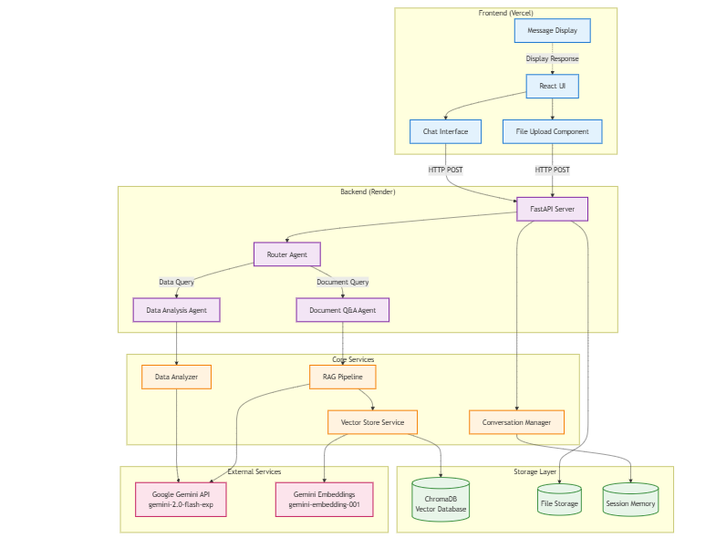
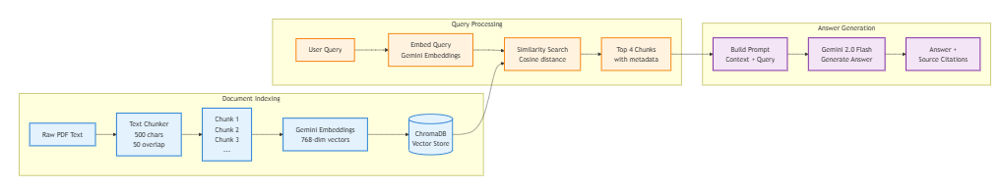
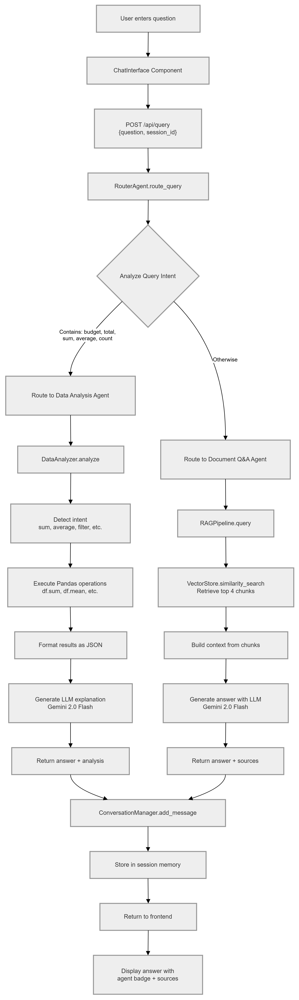
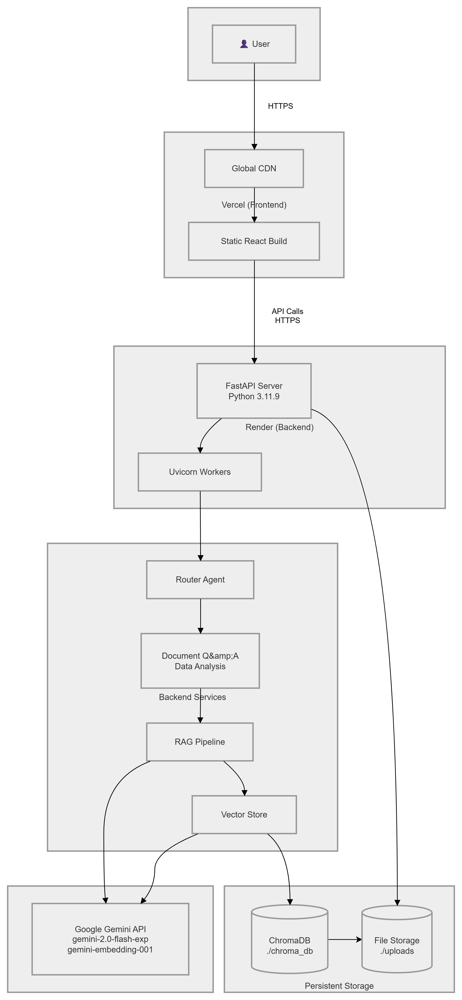

# System Architecture

## 1. Overview

The AI Project Intelligence Assistant is a multi-agent, Retrieval-Augmented Generation (RAG) system designed to analyze both unstructured documents (PDFs) and structured data (CSV/Excel).

It combines LLMs, vector search, and traditional data processing to deliver accurate, context-aware responses with source citations.

## 2. High-Level Architecture


### Key Components

Frontend (React on Vercel) — User interaction (file upload + chat)
Backend (FastAPI on Render) — API + orchestration
Router Agent — Determines query intent
Document Q&A Agent — Handles PDF queries via RAG
Data Analysis Agent — Handles structured data via Pandas
Vector Store (ChromaDB) — Stores embeddings
Google Gemini API — LLM + embeddings

## 3. Technology Selection

### LLM — Google Gemini (gemini-2.0-flash-exp)

- Free tier (no cost constraint)
- Fast response time for chat systems
- Good performance for RAG tasks
- Easy integration via LangChain

**Decision:** Best trade-off between cost, speed, and accessibility.

### Vector Database — ChromaDB

- Local persistent storage (no external service)
- Simple setup, ideal for MVP
- Supports semantic similarity search

**Decision:** Prioritized simplicity over scalability.

### Orchestration — LangChain

- Built-in support for RAG pipelines
- Abstraction over LLMs and embeddings
- Easy to extend and swap components

**Decision:** Faster development with production-ready abstractions.

### Backend — FastAPI

- Async support → better performance
- Automatic API documentation
- Strong validation with Pydantic

### Frontend — React

- Component-based architecture
- Efficient state handling for chat UI
- Required by assignment

## 4. Data Pipeline Design (RAG)



### Pipeline Steps

1. PDF text extraction
2. Chunking (500 characters, 50 overlap)
3. Embedding generation (Gemini embeddings)
4. Storage in ChromaDB
5. Retrieval via similarity search
6. Answer generation using LLM

### Chunking Strategy Justification

- **500 characters** balances context vs precision
  - Too small → loses meaning
  - Too large → reduces retrieval accuracy
- **50-character overlap** prevents boundary information loss

## 5. Agent Orchestration



### Agents

1. Router Agent
- Uses keyword-based classification
- Routes queries to appropriate agent
2. Document Q&A Agent
- Uses RAG pipeline
- Returns answers with source citations
3. Data Analysis Agent
- Uses Pandas for computation
- Uses LLM for explanation

### Routing Logic

```python
if query contains ["total", "average", "sum", "count"]:
    → Data Analysis Agent
else:
    → Document Q&A Agent
```

## 6. Failure Handling

The system uses graceful degradation with the following failure handling strategies:
- No files → prompts user to upload
- Invalid queries → descriptive error messages
- Missing columns → explains available data
- LLM failures → retry logic + fallback error

## 7. Deployment Architecture



- Frontend: Vercel (CDN, static hosting)
- Backend: Render (FastAPI server)
- LLM: Google Gemini API
- Storage: Local ChromaDB + file system

## 8. Design Principles

The system is built upon four core design principles:

- Modularity — each component has a single responsibility
- Simplicity — rule-based routing over complex ML routing
- Cost-efficiency — fully free-tier architecture
- Extensibility — easy to add new agents or data sources

